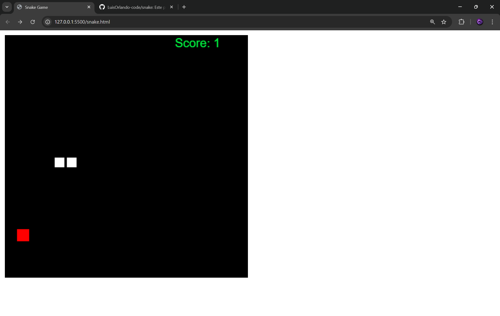

🐍 Snake Game

Un juego clásico de Snake desarrollado con HTML, JavaScript y Canvas, donde controlas una serpiente que crece al comer manzanas 🍎.

🎮 Características
Movimiento con teclas de dirección ⬅️➡️⬆️⬇️
Sistema de puntuación 📊
Generación aleatoria de manzanas 🍎
La serpiente crece al comer
Teletransporte al tocar los bordes (wrap-around)
Interfaz simple y ligera
🛠️ Tecnologías utilizadas
HTML5
JavaScript
Canvas API
🚀 Cómo ejecutar el proyecto
Clona el repositorio:
git clone https://github.com/tu-usuario/snake.git
Entra al proyecto:
cd snake
Abre el archivo:
snake.html

O simplemente ábrelo con tu navegador.

🎯 Controles
Tecla	Acción
⬅️	Mover izquierda
➡️	Mover derecha
⬆️	Mover arriba
⬇️	Mover abajo
📈 Sistema de puntuación
Cada manzana comida aumenta el tamaño de la serpiente
El puntaje se muestra en pantalla
Score = longitud de la serpiente - 1
💡 Mejoras futuras
💀 Game Over al chocar con el propio cuerpo
⚡ Aumento progresivo de velocidad
🔊 Sonidos
🎨 Mejor diseño visual
🧠 Modo automático (IA)
👨‍💻 Autor

## 📸 Preview

## 🌎 pagina 
https://snake-pi-dun.vercel.app/

Luis Orlando Flores

